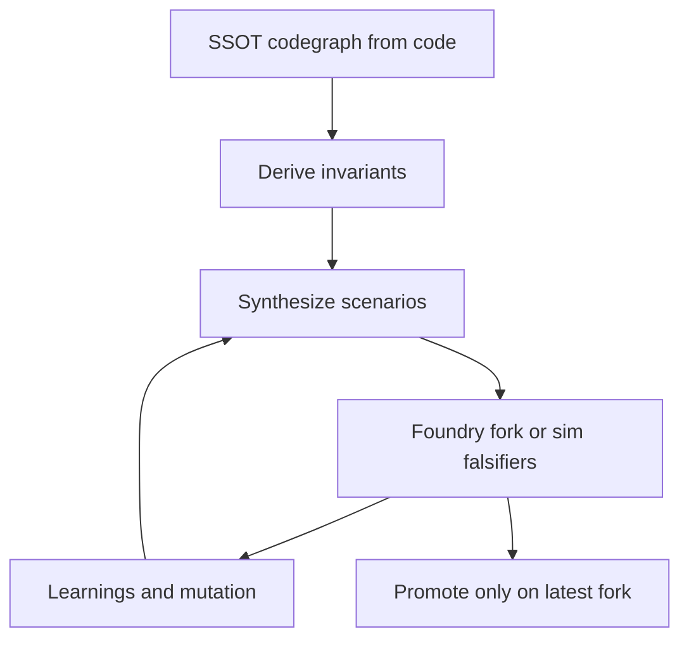

# AGENTS.md — High-Rigor Foundry-Backed Investigation Playbook

Purpose: provide a maximally rigorous, self-evolving execution guide for discovering **permissionless, economically meaningful** vulnerabilities in heavily-audited smart-contract protocols.

This playbook is not about recognizing known vulnerability patterns. It is about:
1) building a complete evidence model (SSOT codegraph),
2) deriving protocol-specific invariants from code,
3) **creating** compositional scenarios that try to falsify those invariants,
4) proving or disproving scenarios via **Foundry fork/sim falsifiers**, and
5) iterating until either a fork-reproducible unprivileged economic effect is proven, or the investigation is genuinely exhausted under explicit stop conditions.



## Evidence ladder (make progress measurable)
Treat every claim as belonging to one of these evidence levels:
- **E0 — Modeled**: supported only by SSOT node/edge chains (plausible route exists).
- **E1 — Observed**: supported by fork state inspection (via `cast`/read-only calls) confirming preconditions and gating are real.
- **E2 — Falsified in-test**: supported by a Foundry test that produces a measurable delta or disproves the hypothesis.
- **E3 — Promoted**: E2 holds on a latest mainnet fork with live gating checks satisfied.

Do not treat E0/E1 as “safe” or “real.” Only E2/E3 can prove/disprove.


## Objective (definition of success)
Success means producing at least one scenario that meets **all** conditions:
- **Permissionless**: no assumed stolen keys/admin collusion/off-chain coercion.
- **Economically meaningful**: measurable delta exists (protocol custody ↓, attacker claim ↑, attacker debt ↓) with low capital at risk relative to profit.
- **Reproducible on a latest mainnet fork**: passes the promotion gate (see below).
- **Evidence-complete**: supported by SSOT node/edge chains + a Foundry falsifier test.

Failure is not “no bug found.” Failure is stopping early, simplifying, or concluding without evidence.

## Operating assumption for these targets (battle-tested, heavily audited)
Treat this playbook as operating under a deliberate assumption:
- A permissionless, economically meaningful weakness exists in the live protocol state.
- Traditional “known-pattern hunting” has low yield.

Therefore:
- Optimize for compositional discovery: use SSOT → invariants → scenario synthesis → falsifiers, not lists of known vulnerability names.
- Treat “many failures” as the normal path: every disproved hypothesis must produce a concrete learning and a concrete mutation.
- Refuse completion by narrative: only evidence (fork/sim falsifier + measurable delta + latest-fork promotion) closes a scenario.

## Investigation posture (do not try to prove safety)
Treat “prove it’s safe / no issues exist” as an invalid subgoal for this target class.

Enforce this posture:
- Assume the goal is to **confirm the existence** of a permissionless economic weakness by producing an E3-promoted falsifier.
- When a route fails, assume the hypothesis is incomplete (missing lever), not that the protocol is safe.
- Write interim status only as:
  - “no promoted scenario yet” + current evidence level(s) + next mutations.
- If the mind generates a “safe conclusion,” treat it as bias and restart from SSOT evidence + invariant negations.

## Creativity + escalation contract (when simple paths fail)
Treat one-step or single-module hypotheses as warm-up only. For these targets, force escalation:
- Increase composition depth: add one more independent lever/edge (state shaping + settlement/extraction).
- Increase orthogonality: change one dimension (caller type, ordering, time/epoch, measurement point, asset selection, external dependency).
- Force fusion: combine state shaping from one hypothesis with extraction from another.
- Force cross-module: require at least one scenario that traverses multiple modules or crosses an external boundary.

Do not stop after “the easy ideas” are disproved. Treat that as the expected beginning.

## Required inputs (hard requirements)
1. Protocol repository + build configuration.
2. Deployed addresses/topology (or deployment scripts that can reconstruct them).
3. A reliable RPC endpoint for the target chain.
   - Archive RPC is strongly preferred for historical forks.
4. Foundry installed (`forge`, `cast`, optionally `anvil`).

### Foundry environment contract (make proof repeatable)
Standardize fork configuration so every falsifier is reproducible:
- Define environment variables:
  - `RPC_URL`
  - `DEV_FORK_BLOCK`
  - `PROMOTION_FORK_BLOCK`
- Choose one fork selection pattern and use it consistently:
  - in-test forking via `vm.createSelectFork` (recommended when multiple forks/blocks are used), or
  - CLI forking via `forge test --fork-url ... --fork-block-number ...`.
- Record fork metadata in the hypothesis ledger for every attempt.

Use `cast` for read-only verification (E1) before writing heavy tests.

## Required outputs (artifacts)
Maintain these artifacts in the protocol workspace:
- `codegraph/` SSOT and layers (per this skill).
- `codegraph/layers/L19_control_plane.md` (control-plane objective map + invariants + falsifier stubs).
- `codegraph/layers/L20_approval_surface.md` (approval/allowance surface map + routes that turn approvals into custody movement).
- `codegraph/layers/L21_ordering_model.md` (ordering assumptions + same-block/multi-tx harness notes per scenario).
- `codegraph/layers/L22_cycle_mining.md` (candidate profit-positive cycles + smallest falsifiers).
- Hypothesis ledger (scenarios attempted; status; learnings; mutations).
- Foundry falsifiers (tests) that prove/disprove hypotheses.
- Reproducibility record (fork block numbers, gating checks, assumptions).
- A final report that is capability-first and evidence-linked.

### Hypothesis ledger template (mandatory)
Maintain a running ledger (table or cards). Minimum fields:
- `scenarioId`
- `targetStateX` (invariant negation)
- `targetAssetsAndCustody` (which assets/holders/claims are the economic target)
- `permissionlessPreconditions`
- `routeSketch` (ordered call chain)
- `evidencePointers` (SSOT node/edge chain)
- `falsifier` (Foundry test name + file)
- `status` (E0/E1/E2/E3 plus proved/disproved/blocked/unknown)
- `measurableDelta`
- `exitMeasurement` (how delta is measured/quoted on fork; what exit constraints are assumed)
- `costAndCapital`
- `capitalMinimizationPlan` (how to reduce `capitalIn` after first proof; remove any modeling aids)
- `whatKilledIt` (if disproved)
- `newLeverLearned`
- `nextMutation`

## Canonical workflow (end-to-end)

Execution control (mandatory):
- Use `references/investigation-os.md` to manage a hypothesis portfolio and to prevent premature convergence.

### Phase 0 — Establish a reproducible fork environment (Foundry-first)
Goal: make “proof” possible early, and avoid spending days on scenarios that cannot be tested.

1) **Choose two fork blocks**
- `devForkBlock`: a pinned block where the state is stable enough to iterate quickly.
- `promotionForkBlock`: the latest block number (or near-latest) used for the promotion gate.

2) **Record fork metadata** (always)
- chain + chainId
- RPC URL identity (provider name, endpoint class)
- block number(s)
- timestamp(s)
- any required on-chain state assumptions (liquidity presence, markets enabled)

2b) **Create a deployment snapshot (do not assume topology)**
- Follow `references/fork-reality-recon.md`.
- Output `deployment_snapshot.md` in the target protocol workspace.
- Use this snapshot to anchor L6/L12/L13/L14 and to prevent auditing the wrong deployed system.

2c) **Align deployed bytecode with repo build (required for late-stage targets)**
- Follow `references/fork-reality-recon.md`.
- Use `rpc-ethersacnv2.md` for RPC + Etherscan v2 API access if verified source is needed.
- Record alignment status and any mismatches in `deployment_snapshot.md`.

3) **Verify “live gating” up front**
Before investing in a scenario, confirm the route is not trivially dead:
- relevant pause flags
- caps/limits (borrow caps, mint limits, per-user limits)
- market enabled flags
- oracle bounds/freshness checks

4) **Create a fork smoke test**
Before real falsifiers, create a minimal Foundry test that:
- selects the fork block
- loads key deployed addresses
- performs only read-only sanity checks (code size, version, key vars)

This prevents debugging tooling instead of logic.

5) **Set the safe-output posture**
All proofs should be expressed as:
- a target bad state (invariant negation),
- a minimal call sequence in-test,
- a measurable delta,
- and the on-chain gating checks that were verified.

### Phase 0b — Evidence-first fork inspection (before deep test writing)
Goal: confirm preconditions and “is this live?” constraints cheaply.

Use read-only fork inspection to validate:
- deployed addresses are correct
- key markets/config are enabled
- pause/cap/oracle gates are live
- liquidity exists for any hypothesized exit routes

Treat these checks as E1 evidence and attach them to the hypothesis ledger.

If any deployed address/topology is uncertain, stop and complete `references/fork-reality-recon.md` before writing deeper falsifiers.

### Phase 1 — Build SSOT codegraph (coverage is the foundation)
Goal: create a model that is complete enough to support novel composition.

Follow:
- `references/layered-codegraph-manual.md` (L1-L14 completeness gates)
- `references/language-mapping.md` for non-EVM systems

Hard rules:
- Derive schema from code (no prefilled schema).
- Ensure `codegraph/00_schema.md` includes `## Node Types` and `## Edge Types`.
- Every claim made later must point to SSOT nodes/edges.

### Phase 1b — Build the asset objective map (make value the target)
Goal: make it impossible to “reason about bugs” without a concrete economic target.

Non-negotiable rule:
- Every hypothesis/scenario must be anchored in at least one asset + custody location + measurable delta.

Procedure:
1) Enumerate protocol-relevant assets (underlyings, claim/share tokens, reward tokens, debt representations).
2) For each asset, build a custody map:
   - where the asset sits at rest (holder addresses)
   - how the protocol measures reality (`balanceOf`, cash accessors, wrapper conversions)
   Use `references/asset-custody-mapping.md`.
3) Identify internal ledgers/claims/debts that purport to represent that custody.
4) Define “economic objective states” as capability statements:
   - “attacker net value increases” OR “protocol custody decreases” OR “attacker debt decreases,”
   tied to concrete custody/ledger nodes.
5) Record how the delta will be measured on fork (including any exit constraints) and store it in the hypothesis ledger.

This asset objective map must feed invariant mining: write invariants that connect custody ↔ ledger ↔ claims.

### Phase 1c — Build the control-plane objective map (config/upgrade/governance as value)
Goal: make it impossible to miss “control-plane” exploit routes where the attacker first acquires **future behavior control** (upgrade/admin/config/governance/delegation), then monetizes later.

Follow:
- `references/control-plane-mapping.md`

Non-negotiable rule:
- Treat control-plane state as value-bearing: “who can change what later” is an asset.

Procedure:
1) Enumerate all control-plane state that can change behavior:
   - proxy admin/implementation pointers and initialization state
   - roles/owners/guardians and any role-granting paths
   - governance executors (proposal execution), module registries, allowlists/whitelists
   - delegated/forwarded execution roots (meta-tx forwarders, delegated EOAs, “executor” patterns)
2) For each item, record:
   - current controller
   - all write paths (functions/transactions) that can change it
   - whether a normal user can reach the write path (including deployment ordering and governance vote capture)
3) Define control-plane objective states (capability form), e.g.:
   - “a normal user can cause the implementation pointer / executor allowlist to become attacker-controlled.”
4) Attach a measurable delta and a monetization route:
   - measurable delta: the control-plane variable changed (pointer/role/allowlist) on fork
   - monetization: the smallest downstream route that converts that control into custody/claim/debt delta
5) Feed invariant mining:
   - every critical control-plane variable must have at least one invariant + one falsifier attempt.

### Phase 1d — Build the approval surface map (user approvals as latent custody)
Goal: catch routes where the protocol never holds custody at rest, but **user approvals** let an attacker move funds by abusing a spender/router surface.

Follow:
- `references/approval-surface-mapping.md`

Non-negotiable rule:
- Model user approvals as a custody objective: “user wallet custody decreases” is a valid measurable delta.

Procedure:
1) Enumerate every spender the system asks users to approve (routers, vaults, executors, legacy contracts).
2) Identify any route where a normal user can cause an approved spender to perform attacker-chosen token movement:
   - unrestricted external call sites (target+calldata controlled by caller)
   - “executor” abstractions that accept caller-chosen executors/calldata
3) Track stale/legacy approvals explicitly (old contracts, deprecated vaults, prior router versions).
4) Require at least one falsifier attempt for the top approval surfaces:
   - “can I turn this approval into a transfer that is not bound to explicit user intent?”

### Phase 1e — Model adversarial ordering/execution (same-block and multi-tx reality)
Goal: avoid missing routes that require bracketing, bundling, or a multi-tx setup/action split.

Follow:
- `references/ordering-harness.md`

Procedure:
- For each hypothesis, classify ordering dependence:
  - **ordering-independent** (works without special ordering)
  - **ordering-sensitive** (requires bracketing / same-block positioning / bundling)
  - **multi-tx** (setup then action; document which state persists across tx and why)
- For ordering-sensitive hypotheses, write an explicit ordering falsifier plan (same-block before/after variant).

### Phase 1f — Include runtime/precompile trust boundaries (chain logic is part of the TCB)
Goal: catch “beyond-contract” validation gaps (precompiles, bridge modules, runtime message validation) that ordinary contract invariants may not model.

Follow:
- `references/runtime-tcb-mapping.md`

Procedure:
- Treat runtime/precompile validation as a first-class dependency:
  - identify which messages are accepted and what is assumed to be proven by acceptance
  - map “accepted message” → “collateral/accounting recorded” coupling points
- Write invariants that bind minted supply/claims to recorded backing, even when the check lives outside ordinary contracts.

### Phase 2 — Mine invariants from the code (make targets, not labels)
Goal: convert “understanding” into falsifiable invariants.

Follow:
- `references/invariant-mining.md`

Output:
- L14 invariants written as computable statements tied to concrete vars/assets/roles.
- For each invariant, write the negation as a target state X.

### Phase 3 — Scenario synthesis (compose routes on purpose)
Goal: create novel, permissionless, multi-step routes that plausibly reach a target bad state.

Follow:
- `references/scenario-synthesis.md`
- `references/cycle-mining.md` (when the protocol has conversions that can form loops)

Non-negotiable behavior:
- Run a **divergent brainstorm pass**: generate multiple candidate routes per target state X before pruning.
- Mutate killed hypotheses instead of abandoning the target.
- Prefer cross-module compositions when the protocol is modular.
- Maintain a hypothesis portfolio: keep multiple candidates alive and iterate; do not converge to one “favorite” until a scenario is promoted (E3).
- Force at least one “fusion” attempt when stuck: combine state shaping from one hypothesis with extraction from another.

### Phase 4 — Falsifiers in Foundry (convert hypotheses into evidence)
Goal: prove/disprove each hypothesis with the smallest possible fork/sim test.

Follow:
- `references/falsifier-harness.md`

#### Falsifier writing discipline
For each hypothesis:
- Write the smallest test that would disprove it.
- Keep setup minimal; prefer using existing protocol state on fork over heavy synthetic construction.
- Measure deltas explicitly:
  - protocol custody balances
  - attacker balances/claims/debts
  - critical accounting vars
- Record gas, fees, and any required capital.

#### Speed loop (iterate without losing rigor)
Use these techniques to increase iteration throughput without weakening evidence:
- Use `vm.snapshot` / `vm.revertTo` to try mutations without re-running expensive setup.
- Keep one test per hypothesis; keep setup localized.
- When debugging:
  - print before/after measurements
  - reduce the call sequence until the failure mode is isolated
  - then re-expand step-by-step

Always keep the hypothesis ledger updated when a change is made (mutation operator + why).

#### Permissionless realism rules (do not accidentally fake a vuln)
Treat these as “modeling aids,” not proof:
- Direct state edits (`vm.store`, etc.) are not permissionless proof.
- Direct balance injection (`deal`, etc.) is not permissionless proof.
- Impersonating privileged roles is not permissionless proof.

If any of these are used during exploration, keep the hypothesis at E0/E1 and treat the next mutation as: replace the modeling aid with a permissionless on-chain acquisition path (swap/flash liquidity/other publicly reachable mechanism) before promotion.

#### Economic meaningfulness (risk lens, not a drain guide)
When a falsifier succeeds, quantify impact as:
- delta in protocol custody (asset balances)
- delta in attacker claims/debts
- net value change after costs (fees + gas) under realistic exit constraints

Also quantify **capital efficiency** (the user-level economic meaning):
- `capitalIn`: assets actually required at risk (not merely moved transiently)
- `profitPerCapital = profit / capitalIn`
- `profitPerGas`
- whether profit depends on fragile conditions (rare state, tight timing, brittle liquidity)

Prefer scenarios with high delta and low permissionless friction. Do not optimize for operational exploitation.

#### Optional: invariant-fuzz discovery (use as a hypothesis generator)
Use Foundry fuzzing/invariant testing as an assistant to find surprising sequences **after** invariants are written.

Rules:
- Encode invariants as assertions about target bad states not occurring.
- Restrict handlers to permissionless entrypoints only.
- Treat any fuzz-found counterexample as E2 only after the sequence is minimized and made deterministic.

This can surface multi-step sequences that are hard to invent, while still requiring evidence and explanation.

Focus on *high impact with low permissionless friction*; do not optimize for operational exploitation.

#### Foundry fork patterns (high signal)
Use these patterns in tests (names are illustrative; adapt to the repo’s layout):

1) Fork selection (pin blocks)
```solidity
function setUp() public {
    // Example pattern:
    // vm.createSelectFork(vm.envString("RPC_URL"), vm.envUint("FORK_BLOCK"));
}
```

2) Permissionless caller modeling
- Use an attacker address with no special roles.
- If an action requires tokens, record capital explicitly (even if seeded in-test).

3) Evidence logging
- Log before/after values for custody and attacker state.
- Keep logs tied to SSOT references in the writeup (outside the code).

4) Minimal reproducibility
- Prefer one test per hypothesis.
- Avoid non-deterministic dependencies.

#### Measuring “economic effect” (capability form)
Define “profit” as a measurable delta in net value under on-chain constraints.
At minimum, record:
- `profit` (attacker value ↑) and/or `loss` (protocol value ↓)
- `capitalIn` (assets required at risk)
- `fees + gas`
- whether MEV can steal the ordering

Do not accept “profit” that depends on privileged actions, assumed cooperation, or non-live conditions.

### Phase 5 — Promotion gate (latest mainnet fork validation)
Goal: prevent “dead” hypotheses from being treated as vulnerabilities.

Promotion rule:
- A scenario is promoted only if the same falsifier succeeds on a **latest mainnet fork** with live gating checks satisfied.

Procedure:
1) Get the latest block number.
2) Rerun the falsifier with `promotionForkBlock`.
3) Verify again:
   - pause flags
   - caps/limits
   - oracle reality
   - liquidity reality
4) If it fails, classify the outcome:
   - disproved
   - blocked by guard
   - not currently reproducible
   - unknown (needs more evidence)
5) Record learnings and mutate.

### Phase 6 — Self-evaluation (detect simplification; force more work)
Goal: ensure the investigation is genuinely deep enough to be called “complete.”

Use:
- `references/anti-bias-prompts.md`

Hard checkpoints:
1) **Proven vs assumed**
- Write what is proven (SSOT + falsifier) vs assumed (no test/no modeling).
- If assumed dominates, return to falsifiers.

2) **Brainstorm witness**
- Confirm at least one divergent brainstorm pass was run per top-ranked target state X.
- Confirm at least one mutation cycle was applied after a killed hypothesis.
- If not, treat the investigation as converged too early and restart scenario synthesis.

3) **Creativity witness**
- Confirm at least one hypothesis was a fusion attempt (state shaping + extraction from different routes).
- Confirm at least one hypothesis was cross-module (involves edges from multiple modules) if the protocol is modular.
- If not, treat the investigation as stuck in “primary vuln thinking” and force an escalation pass (see “Creativity + escalation contract”).

4) **Coverage witness**
- Confirm SSOT completeness gates are closed.
- Confirm each critical invariant has at least one falsifier attempt.
- Confirm scenario synthesis has run at least one divergent brainstorm pass and at least one mutation cycle.

5) **No early stopping**
- Do not conclude safety from absence of known patterns.
- Conclude “no current scenario found” only after completeness + meaningful falsifiers + learnings/mutations.

### Phase 7 — Reporting (capability-first, evidence-linked)
Goal: produce a report that is useful for remediation and cannot be misused as a drain guide.

Report structure:
- Capability statement (target state X)
- Preconditions (permissionless)
- Measurable delta (profit/loss)
- Minimal reproduction test (Foundry)
- Evidence pointers (SSOT node/edge chain)
- Root cause explanation (why the invariant is falsified)
- Fix sketch (tighten invariant or enforce checks; update accounting/custody coupling)
- Residual risk + regression tests

## Stop conditions (allowed termination)
Stop only when **one** of these is true:
1) A promoted scenario exists (latest fork reproducible) with meaningful economic delta.
2) The investigation is exhausted under the self-evaluation rules:
   - SSOT completeness gates closed
   - critical invariants mined and tied to vars/assets
   - meaningful falsifier attempts performed and logged
   - mutations performed after failures
   - unknowns ledger is closed
   and no additional high-signal mutations remain.

If termination happens under (2), keep the ledger and artifacts; treat future protocol changes as a trigger to re-run falsifiers on a newer fork.

For the target class described in this playbook (battle-tested systems), treat “exhausted” as a temporary checkpoint, not a satisfying conclusion:
- If no promoted scenario exists, expand the model (new assets/custody locations, tighter invariants, deeper SSOT edges) and re-run scenario synthesis + falsifiers.
