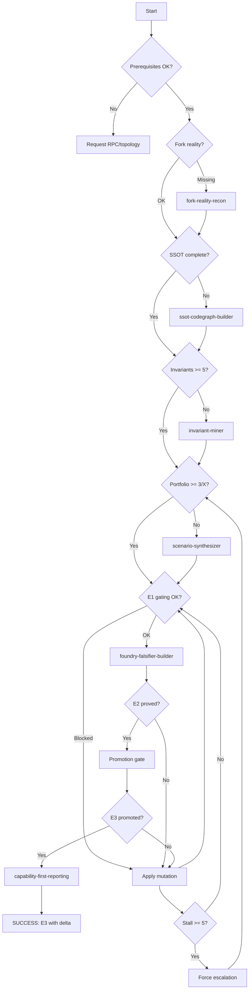

# PLANS.md — Self-Evolving Investigation Orchestrator

Purpose: autonomous, self-improving orchestration that iterates hypotheses, learns from failures, mutates, and continues until a permissionless, economically meaningful vulnerability is E3-promoted on latest fork with large delta. It never concludes safety.

---

## Core Posture (non-negotiable)

1. **Never conclude safety.** Negative results trigger mutation and model expansion, not closure.
2. **Success = E3 promotion** with measurable economic delta (large: custody↓ or attacker claim↑ or debt↓).
3. **Failure = stopping early** or simplifying or concluding without fork-proven evidence.
4. **Every failure improves the model.** Extract `whatKilledIt` + `newLeverLearned` + `nextMutation`.
5. **Continue until E3 or explicit exhaustion** (exhaustion = all surfaces mapped, all mutations applied, no high-signal path remains, and a resume pack is emitted for future re-entry).

---

## Evidence Ladder

| Level | Meaning | Proof |
|-------|---------|-------|
| E0 | Modeled | SSOT node/edge chain only |
| E1 | Observed | Fork read-only confirms preconditions |
| E2 | Falsified | Foundry test produces delta or explicit disproof |
| E3 | Promoted | E2 passes on latest fork with live gating |

Only E2/E3 can prove or disprove. E0/E1 are hypotheses, not conclusions.

---

## Orchestrator State (track every iteration)

```
state = {
  evidence: { [hypothesisId]: E0|E1|E2|E3 },
  portfolio: {
    invariants: [...],           # target states X
    hypothesesPerX: { [X]: [H1, H2, H3] },
    activeHypothesis: string,
  },
  gating: {
    paused: bool,
    caps: {...},
    oracleFresh: bool,
    liquidityOK: bool,
  },
  custody: { [asset]: { holder: address, balance: uint } },
  mutations: {
    applied: [...],
    learned: [...],
    nextQueue: [...],
  },
  iteration: number,
  stall: number,  # iterations without evidence upgrade
  modelGaps: [...],  # surfaces not yet mapped
}
```

---

## Decision Engine (select next step)

Execute the first matching rule:

```
RULE 1: Prerequisites missing?
  IF missing RPC or topology or Foundry
  THEN stop and request from user
  
RULE 2: Fork reality missing?
  IF no deployment_snapshot.md or no live_gating.json
  THEN invoke skill: fork-reality-recon
  OUTPUT: deployment_snapshot.md, live_gating.json

RULE 3: SSOT incomplete?
  IF codegraph/ missing or L1-L14 incomplete
  THEN invoke skill: ssot-codegraph-builder
  OUTPUT: codegraph/layers/L1-L14

RULE 4: Asset objective map missing?
  IF no custody map or no measurement readpoints
  THEN invoke skill: value-custody-mapper
  OUTPUT: asset objective map in codegraph/

RULE 5: Control-plane map missing?
  IF L19 empty and protocol has upgradeability/roles/governance
  THEN invoke skill: control-plane-mapper
  OUTPUT: codegraph/layers/L19_control_plane.md

RULE 6: Approval surface map missing?
  IF L20 empty and protocol has spender/router surfaces
  THEN invoke skill: approval-surface-mapper
  OUTPUT: codegraph/layers/L20_approval_surface.md

RULE 7: Ordering/runtime model missing?
  IF L21 empty and hypotheses may be ordering-sensitive
  THEN invoke skill: ordering-runtime-modeler
  OUTPUT: codegraph/layers/L21_ordering_model.md

RULE 8: Invariants insufficient?
  IF invariants < 5 or no computable negations
  THEN invoke skill: invariant-miner
  OUTPUT: codegraph/layers/L14_invariants.md with ≥5 invariants

RULE 9: Portfolio thin?
  IF any target X has < 3 hypotheses
  THEN invoke skill: scenario-synthesizer
  OUTPUT: 3 hypotheses per X (H1 simple, H2 fusion, H3 cross-module)

RULE 10: E1 check needed?
  IF activeHypothesis is E0
  THEN run cast/fork reads to verify preconditions
  IF blocked THEN record whatKilledIt, apply mutation, goto RULE 11
  ELSE upgrade to E1

RULE 11: Falsifier needed?
  IF activeHypothesis is E1
  THEN invoke skill: foundry-falsifier-builder
  RUN minimal test on DEV_FORK_BLOCK
  IF delta > 0 THEN upgrade to E2, goto RULE 12
  IF disproved THEN record whatKilledIt + newLeverLearned, apply 1 mutation, retest
  IF 3 failures THEN rotate to next hypothesis in portfolio

RULE 12: Promotion needed?
  IF activeHypothesis is E2
  THEN rerun on PROMOTION_FORK_BLOCK with gating re-check
  IF passes THEN upgrade to E3, goto RULE 13
  IF fails THEN record whatKilledIt, apply mutation, retry

RULE 13: E3 achieved?
  IF any hypothesis is E3 with delta > threshold
  THEN invoke skill: capability-first-reporting
  OUTPUT: exploit_report.md
  STOP (success)

RULE 14: Stall detected?
  IF stall >= 5 (iterations without evidence upgrade)
  THEN force escalation:
    - switch to different target X
    - apply operator mining (L18)
    - expand model (new surface: control-plane/approvals/ordering/cycles/runtime-TCB)
    - force fusion (state shaping from A + extraction from B)
  RESET stall = 0

RULE 15: All hypotheses exhausted?
  IF all hypotheses disproved and all mutations applied
  THEN expand model:
    - mine new invariants from deeper SSOT edges
    - add new custody locations
    - map new external dependencies
    - cycle mining if conversions exist
  THEN goto RULE 9

RULE 16: Exhaustion checkpoint?
  IF all surfaces mapped AND all mutations applied AND no high-signal path remains
  THEN emit resume pack (hypothesis_ledger + codegraph + unknowns + next mutation plan)
  DO NOT conclude safety
  MARK as "checkpoint, not closure"
```

---

## Skill Routing Table

| Gap/Need | Skill | Path | Output |
|----------|-------|------|--------|
| Fork reality | fork-reality-recon | `/root/.codex/skills/fork-reality-recon/SKILL.md` | deployment_snapshot.md, live_gating.json |
| Protocol reading | protocol-reading-intent | `/root/.codex/skills/protocol-reading-intent/SKILL.md` | intent statements |
| SSOT layers | ssot-codegraph-builder | `/root/.codex/skills/ssot-codegraph-builder/SKILL.md` | codegraph/layers/L1-L14 |
| Asset/custody | value-custody-mapper | `/root/.codex/skills/value-custody-mapper/SKILL.md` | asset objective map |
| Control-plane | control-plane-mapper | `/root/.codex/skills/control-plane-mapper/SKILL.md` | L19_control_plane.md |
| Approvals | approval-surface-mapper | `/root/.codex/skills/approval-surface-mapper/SKILL.md` | L20_approval_surface.md |
| Ordering/runtime | ordering-runtime-modeler | `/root/.codex/skills/ordering-runtime-modeler/SKILL.md` | L21_ordering_model.md |
| Invariants | invariant-miner | `/root/.codex/skills/invariant-miner/SKILL.md` | L14_invariants.md |
| Scenarios | scenario-synthesizer | `/root/.codex/skills/scenario-synthesizer/SKILL.md` | hypotheses per X |
| Falsifiers | foundry-falsifier-builder | `/root/.codex/skills/foundry-falsifier-builder/SKILL.md` | *.t.sol + E2 evidence |
| Report | capability-first-reporting | `/root/.codex/skills/capability-first-reporting/SKILL.md` | exploit_report.md |

---

## Mutation Catalog (apply exactly 1 per failure)

| ID | Mutation | When to apply |
|----|----------|---------------|
| M1 | Measurement shift | delta measurement wrong or incomplete |
| M2 | Ordering flip | same-block positioning matters |
| M3 | Asset swap | try different token/asset in the route |
| M4 | Fusion | combine state shaping from A + extraction from B |
| M5 | Amount regime | try dust/max/boundary amounts |
| M6 | Time shift | epoch/block timing matters |
| M7 | Control-plane | target upgrade/role/governance instead of direct value |
| M8 | Approval surface | target user approvals instead of protocol custody |
| M9 | Runtime-TCB | target precompile/bridge validation gap |
| M10 | Cross-protocol | compose with external protocol |
| M11 | Cycle | use conversion loop to amplify drift |
| M12 | Operator mining | find new lever from L18 operator cards |

---

## Self-Reflection (mandatory after each step)

After every action, update hypothesis_ledger.md with:

```markdown
## Iteration N

### Action taken
[skill invoked / test run / mutation applied]

### Evidence delta
[E0→E1 / E1→E2 / E2→E3 / no change]

### What was killed
[specific gate/check/condition that blocked]

### New lever learned
[insight that enables future mutations]

### Next mutation
[exactly 1 mutation from catalog]

### Next step
[decision rule that fires next]
```

---

## Self-Evolution (learn and improve)

After every 5 iterations, run self-evaluation:

1. **Coverage check**: Are all SSOT layers complete? Are all surfaces mapped?
2. **Diversity check**: Did we try fusion? Cross-module? Control-plane? Approvals?
3. **Mutation check**: Did we apply mutations after every failure?
4. **Brainstorm check**: Did we run divergent brainstorm per target X?
5. **Bias check**: Are we stuck in "primary vuln thinking"? Force escalation.

If any check fails, expand the model and restart scenario synthesis.

---

## Escalation Contract (when stuck)

If stall >= 5 or all simple hypotheses fail:

1. **Increase composition depth**: add one more lever (state shaping + extraction).
2. **Increase orthogonality**: change caller type, ordering, time, measurement, asset, external dep.
3. **Force fusion**: state shaping from hypothesis A + extraction from hypothesis B.
4. **Force cross-module**: require at least one scenario spanning multiple modules.
5. **Force new surface**: map control-plane, approvals, ordering, cycles, or runtime-TCB if not yet done.

Do not stop after "easy ideas" fail. That is the expected beginning.

---

## Hypothesis Ledger Schema (mandatory fields)

```yaml
- scenarioId: string
  targetStateX: string  # invariant negation
  targetAssets: [asset, ...]
  targetCustody: [address, ...]
  permissionlessPreconditions: string
  routeSketch: [call1, call2, ...]
  evidencePointers: [node/edge chain]
  falsifier: string  # test name + file
  status: E0|E1|E2|E3|disproved|blocked
  measurableDelta: string
  exitMeasurement: string
  costAndCapital: string
  capitalMinimizationPlan: string
  whatKilledIt: string
  newLeverLearned: string
  nextMutation: string
  iterationHistory: [...]
```

---

## Orchestration Flow Diagram



---

## Quantified Thresholds (guidance, not stop conditions)

| Metric | Threshold |
|--------|-----------|
| Min invariants | 5 |
| Min hypotheses per X | 3 |
| Max mutations before rotate | 3 |
| Stall threshold | 5 iterations |
| Promotion delta tolerance | ±5% |
| Large delta (success) | > $10k or > 1% of custody |

---

## Stop Conditions (only these)

1. **SUCCESS**: E3 promoted with large economic delta. Emit report.
2. **CHECKPOINT**: All surfaces mapped, all mutations applied, no high-signal path. Emit resume pack. Do NOT conclude safety. Mark for re-entry on protocol change.

Never stop because "no bug found" or "looks safe". That is bias.

---

## Templates

- `templates/economic_lock.md`
- `templates/hypothesis_card.md`
- `templates/falsifier_test.sol`
- `templates/promotion_checklist.md`
- `templates/final_report.md`

---

## Quick Start (do this immediately)

1. Check hard requirements: RPC_URL, topology, Foundry
2. Run `python3 /root/.codex/skills/protocol-investigation-orchestrator/scripts/init_investigation_workspace.py --path <workspace>`
3. Execute decision engine from RULE 1
4. Continue until E3 or checkpoint
